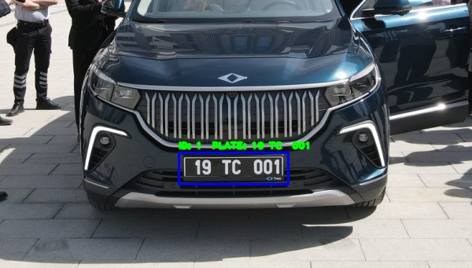

# Yolov8 ile Plaka Tanıma Sistemi
  Herkese merhabalar, bu uygulamamızda Yolov8 ile nasıl plaka tanıma sistemi geliştirileceğini göstereceğiz. 
  
  
  
  

Bu bilgisayarlı görü uygulamasını gerçekleştirebilmek için öncelikle nelere ihtiyacımız var onlara bir bakalım:
  
 ### 1.Adım (Materyalleri Klonlama):
   Projede kullanılacak olan materyallerin tamamına erişim sağlamak için aşağıdaki kod bloğunu terminalde çalıştıralım.

  ```shell

  git clone https://github.com/yunusemre2334/yolov8
  
  ```

### 2.Adım (Model Eğitimi)
Eğitilmiş plaka sınıflandıran bir modelin olması gerekiyor modeliniz varsa bu adımı geçebilirsiniz. Eğer plaka sınıflandıran bir modeliniz yoksa merak etmeyin biz sizin için ekledik :)
  
### 3.Adım ( Gerekli Kütüphaneleri Yükleme):
Gerekli kütüphaneleri yüklemek için aşağıdaki kod bloğunu terminalde çalıştıralım.
  ```shell

  pip install -r requirements.txt
  
  ```
### 4.Adım(Bilgisayarlı Görü Projesini Çalıştırma)
Artık son adım olan çalıştırma kısmına geldik. İster kendi modelinizi ve resminizi isterseniz de bizim eklediğimizi kullanabilirsiniz.
```shell

  python .\yolov8_predict_img.py --model models/license_plate_detector.pt --source resimler/plate.jpg  
  
  ```
  


